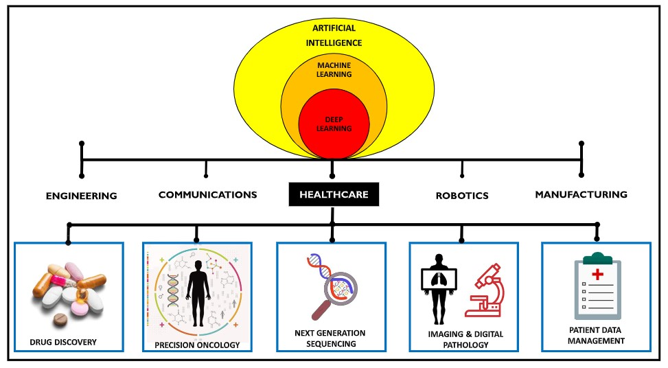
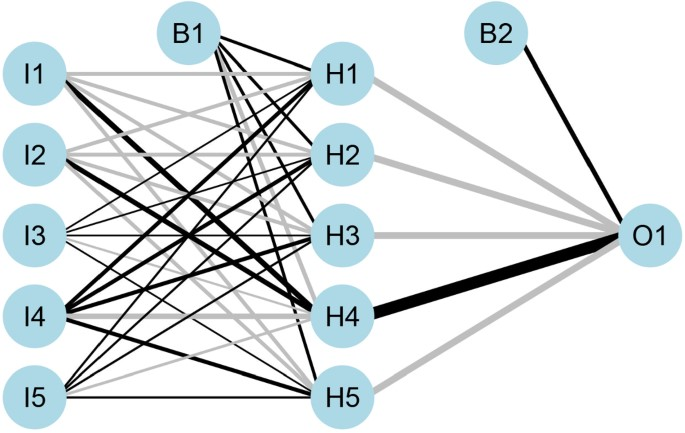
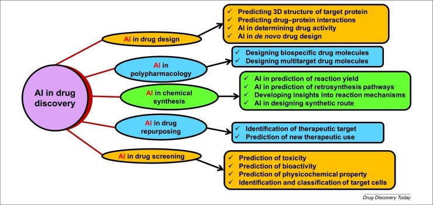
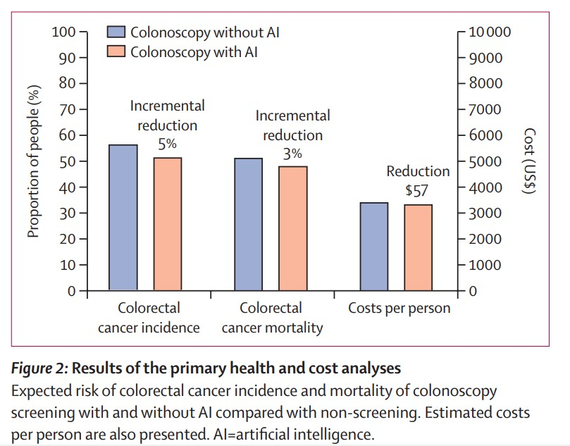
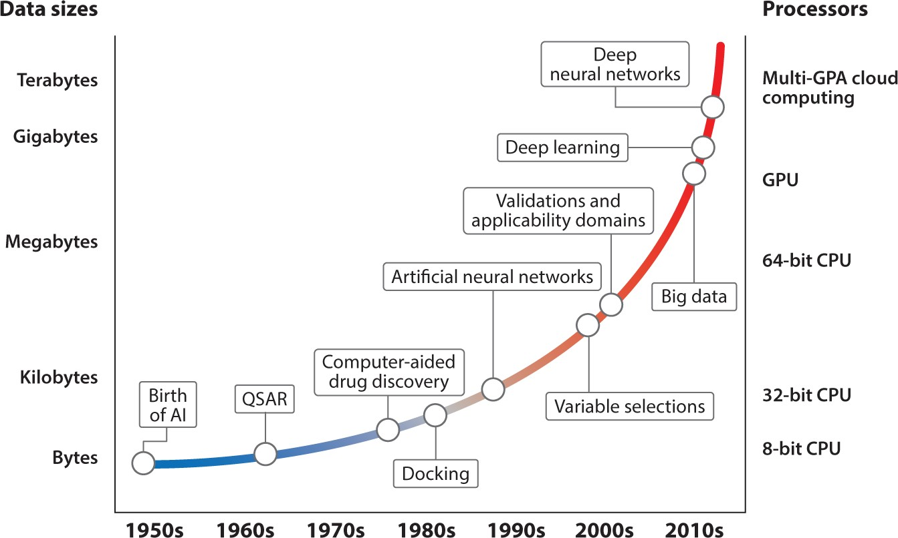
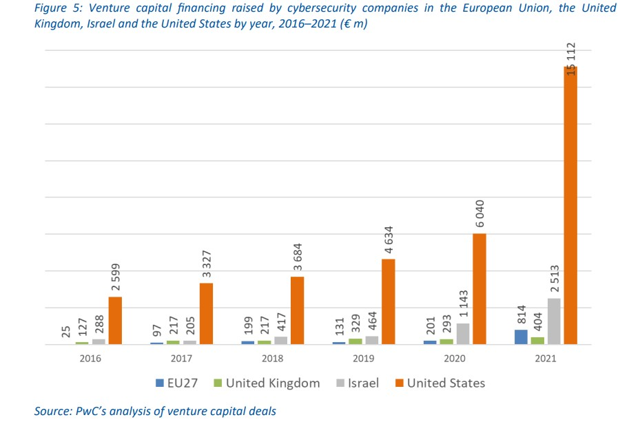
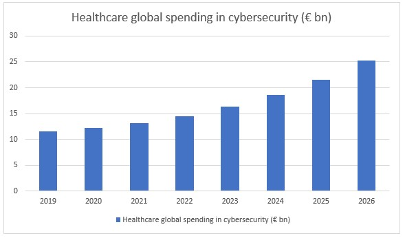
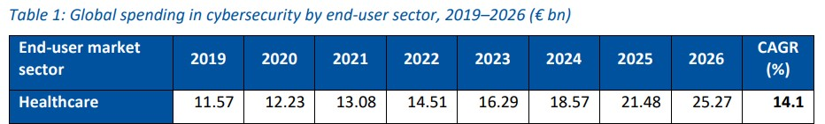

image used from [www.medibot.com.au/ai-general-practice-dentist.php](http://www.medibot.com.au/ai-general-practice-dentist.php)
 
 
## Index:

1. [Introduction](#Introduction)

2. [AI-Driven solutions in Healthcare](#AI-Driven solutions in Healthcare)

&nbsp;- [Diagnosis, Treatment and Patient Monitoring](#Diagnosis, Treatment and Patient Monitoring)

&nbsp;- [Drug Discovery and Disease Modeling](#Drug Discovery and Disease Modeling)

3. [Challenges](#Challenges)

&nbsp;- [Cost](#Cost)

&nbsp;- [Accuracy](#Accuracy)

&nbsp;- [Privacy](#Privacy)

4. [Conclusion](#Conclusion)
 
 
  
# How can AI create efficiency and effectiveness in Digital Health. What are the benefits and challenges to come.
 
 
 
## **Introduction**
 
 
Artificial intelligence (AI) is an emerging technology revolutionizing the healthcare sector. It is transforming healthcare in a variety of ways, from improving patient care to streamlining administrative tasks. The deployment of AI systems can improve efficiency regarding cost and time management by automating administrative tasks and repetitive processes that can be streamlined. It can also increase the effectiveness of medical procedures as AI can be used to analyze specific data and make connections or predictions that humans may not be able to when trying to diagnose a patient or developing new drugs and treatments, enabling healthcare professionals to make more informed decisions. This research paper will explore the potential improvements in healthcare with AI, the efficiency and effectiveness increase it could bring, and the challenges faced upon its implementation.
 
 
 **“An overview of the applications of artificial intelligence”**, (Dlamini et al., 2020d)
 
 

   
image used from [https://www.sciencedirect.com/science/article/pii/S200103702030372X](https://www.sciencedirect.com/science/article/pii/S200103702030372X) 
 
 
 
 
## **AI-Driven solutions in healthcare**
 
 
 
### **Diagnosis, Treatment and Patient Monitoring** 
 
 
It is being used to develop more accurate and efficient methods of diagnosis and treatment while also having the capability to predict possible conditions related to certain symptoms, lifestyles, and social, economic, and geographical environments. AI-driven solutions have the potential to supplement or even replace traditional methods of diagnosis and treatment, such as manual diagnosis and manual treatments. AI-driven treatments can be used to personalize treatments and patient health profiles, which can help doctors better understand patient health and provide more personalized care.
 
 
Example of: **“The role of AI technology in prediction, diagnosis and treatment of colorectal cancer”**
 
 
**“GeoAI works by taking any information and data from a specific geographical area and allows artificial intelligence modalities to compile and retrieve more specific information from these data, based on what type of information they want”**,(Yu & Helwig, 2021)

**“Introduction of an artificial neural network (ANN) with input layer (I), hidden layer (H), bias layer (B) and output layer (O). Connections between each node are dynamically adjusted to the feedback of training process. Positive correlation is showed in black line while negative correlation is in grey line. The thickness of line is in proportion to relative significance. Such ANN allows new input and generates given output”**,(Yu & Helwig, 2021)
 
 
 

 image used from [https://link.springer.com/article/10.1007/s10462-021-10034-y](https://link.springer.com/article/10.1007/s10462-021-10034-y) 
 
 
 
### **Drug Discovery and Disease Modeling** 
 
 
Developing new drugs can be more efficient. Large datasets can be analyzed and help to identify potential drug targets, as well as potential disease pathways. This can personalize the development of new treatments and better understand certain diseases' pathogenesis. AI-driven drug discovery solutions have the potential to significantly reduce the cost and time involved in drug discovery and development. 
 
 
Example of: **“Artificial intelligence in drug discovery and development.”**
 
 
**“To decrease the financial cost and chances of failures that accompany VS, pharmaceutical companies are shifting towards AI. There was an increase in the AI market from US$200 million in 2015 to US$700 million in 2018, and is expected to increase to $5 billion by 2024. A 40% projected growth from 2017 to 2024“**,(Paul et al., 2021)
 
 
 

image used from [https://www.ncbi.nlm.nih.gov/pmc/articles/PMC7577280/](https://www.ncbi.nlm.nih.gov/pmc/articles/PMC7577280/) 
 
 
 
 
## **Challenges**
 
 
The responsible and ethical development of AI in medicine requires the collaboration of multiple stakeholders, including clinicians, researchers, and industry partners. Although it has the potential to revolutionize healthcare, there are still challenges that need to be addressed before it can be widely adopted. These challenges include **cost**, **accuracy**, and **privacy**.
 
 
 
### **Cost**
 
 
As AI is still an emerging technology, we need to consider the total cost of ownership when implementing AI systems, as the cost can quickly add up and profit results may take some time to develop significantly. Although implementing can be costly, in the long run, the expenses come up to be more efficient, meaning certain methods, tasks, and developments can become cheaper balancing, or even generating profit from the initial investment, especially in the branch of screening and imaging tests.
 
 
Example of: **“Cost-effectiveness of artificial intelligence for screening colonoscopy: a modelling study”**, (Areia et al., 2022b)
 
 
 

image used from [https://www.thelancet.com/action/showPdf?pii=S2589-7500%2822%2900042-5](https://www.thelancet.com/action/showPdf?pii=S2589-7500%2822%2900042-5) 
 
 
 
### **Accuracy**
 
 
It is also important to know that AI systems are not perfect and can also create mistakes, such as misdiagnosis. To reduce the risk of errors, big amounts of data accompanied by high-processing computer units are required to successfully train and develop reliable AI systems. This challenge with time will become less likely as the industry grows, budgets increase, and development becomes more advanced. With the advances in the industry, technologies such as cloud-based computing and deep learning will increase the effectiveness of AI, allowing enterprises to share, store, and analyze bigger sets of data, as the era of Big Data arises. 
 
 
Example of: **“Big Data and Artificial Intelligence Modeling for Drug Discovery.”**, (Zhu, 2020)
 
 
 

image used from [https://www.ncbi.nlm.nih.gov/pmc/articles/PMC7010403/](https://www.ncbi.nlm.nih.gov/pmc/articles/PMC7010403/) 
 
 
 
### **Privacy**
 
 
With the rise of cloud-based solutions in AI systems, large amounts of personal data, such as medical records, and data that can be sensitive and confidential are being created. It is important to ensure that it is secure and not used for any purpose other than the intended one. The way Cybersecurity evolves and budgets increase in the upcoming years will play a huge role in the deployment of AI in the future and the safe manipulation of highly personalized data. 
 
 
Example of: **“European Cybersecurity Investment Platform.”**, (European Investment Bank 2023, 2022)
 
 
 

 
 

 
 

CAGR – the compound annual growth rate, is the annualized average rate of revenue growth between any given years.

images used from [ https://www.eib.org/attachments/lucalli/20220206-european-cybersecurity-investment-platform-en.pdf](https://www.eib.org/attachments/lucalli/20220206-european-cybersecurity-investment-platform-en.pdf)
 
 
 
 
## **Conclusion** 
 
 
AI technology is changing the healthcare industry, with the potential to revolutionize the way that doctors practice medicine. **Although not perfect and still a lot to improve in regards to cost, accuracy, and privacy. AI-driven healthcare solutions have the potential to increase the effectiveness and efficiency of diagnosis and treatment, reduce costs, and improve the overall quality of care, by automating processes, streamlining operations, and providing more accurate diagnoses. Tasks and methods such as disease prevention, drug discovery, disease modeling, diagnosis, treatment, and patient monitoring will be improved and more streamlined.** Examples like scheduling appointments, billing, and patient health profiles can all be automated processes, as well as more personalized patient treatment and monitoring. 
The world is becoming more digitally oriented, and the amount of free and created data available has never been so much, big data and machine deep learning are the new focus in digital health, which allow us to analyze faster, create new correlations and predictions in such data quantities, which a few years ago would not be possible. 
**AI still has its challenges; its ethical and effective implementation will need the collaboration of all the required stakeholders in the health and other joint industries. The healthcare industry is evolving and AI is there to follow and improve how to streamline and remodel the practice of medicine worldwide.**
 
 
 
 
 
 
 
## Sources used 

 1. Dlamini, Z., Francies, F. Z., Hull, R., & Marima, R. (2020). Artificial intelligence (AI) and big data in cancer and precision oncology. Computational and Structural Biotechnology Journal, 18, 2300- 2311. https://doi.org/10.1016/j.csbj.2020.08.019
 
 2.	Yu, C., & Helwig, E. J. (2021). The role of AI technology in prediction, diagnosis and treatment of colorectal cancer. Artificial Intelligence Review, 55(1), 323–343. https://doi.org/10.1007/s10462-021-10034-y
 
 3.	Paul, D., Sanap, G., Shenoy, S., Kalyane, D., Kalia, K., & Tekade, R. K. (2021). Artificial intelligence in drug discovery and development. Drug Discovery Today, 26(1), 80–93. https://doi.org/10.1016/j.drudis.2020.10.010 
 
 4.	Areia, M., Mori, Y., Correale, L., Repici, A., Bretthauer, M., Sharma, P., Taveira, F., Spadaccini, M., Antonelli, G., Ebigbo, A., Kudo, S. E., Arribas, J., Barua, I., Kaminski, M. F., Messmann, H., Rex, D. K., Dinis-Ribeiro, M., & Hassan, C. (2022). Cost-effectiveness of artificial intelligence for screening colonoscopy: a modelling study. The Lancet Digital Health, 4(6), e436–e444. https://doi.org/10.1016/s2589-7500(22)00042-5 
 
 5.	Zhu, H. (2020). Big Data and Artificial Intelligence Modeling for Drug Discovery. Annual Review of Pharmacology and Toxicology, 60(1), 573–589. https://doi.org/10.1146/annurev-pharmtox-010919-023324 
 
 6.	European Investment Bank 2023. (2022, October 19). European Cybersecurity Investment Platform. Eib.Org. https://www.eib.org/en/publications/20220206-european-cybersecurity-investment-platform 
 
 7.	AI General Practice Dentist. (n.d.). https://medibot.com.au/ai-general-practice-dentist 
 
